# 压接设备软件 — 架构设计文档（arc42）

| 字段 | 内容 |
|---|---|
| 文档状态 | Draft v0.5 |
| 依据 | `req.xls`（25 张功能截图）、已落地契约与仓库骨架 |
| 系统名称 | Yuanlang Press Software（暂定） |
| 主要读者 | 研发、电气/PLC、测试、项目/工艺 |
| 关联产物 | `contracts/`、`README.md`、`docs/architecture/module-interfaces.md` |
| 图表 | Mermaid（统一配色；兼容旧版预览：无 init 指令；特殊字符节点已加引号） |

---

## 1. Introduction and Goals（引言与目标）

### 1.1 需求概述

本系统为工业压接（Press-Fit）设备提供操作 HMI、配方/程序管理、实时力—位移采集与判定、质量追溯、SPC、校准及 MES 集成能力。目标机型参考需求中的伺服压接机（如 CT-1025E 类）及同类产线工控场景。

核心业务链路：


### 1.2 质量目标

| 优先级 | 质量目标 | 说明 |
|---|---|---|
| 1 | 安全可控 | 急停/光栅等安全功能由硬件/安全 PLC 承担；软件不得绕过安全链 |
| 2 | 控制与数据可靠 | 断网、断电、进程崩溃不导致“假合格”或不可恢复丢失关键周期数据 |
| 3 | 可追溯 | 任一周期可还原配方版本、算法版本、操作者、原始曲线与判定结果 |
| 4 | 可替换硬件 | 通过 Adapter 隔离厂商 SDK，便于换卡/换驱动/仿真 |
| 5 | 可维护演进 | UI（React）与控制服务解耦；契约（gRPC/OpenAPI）先行 |

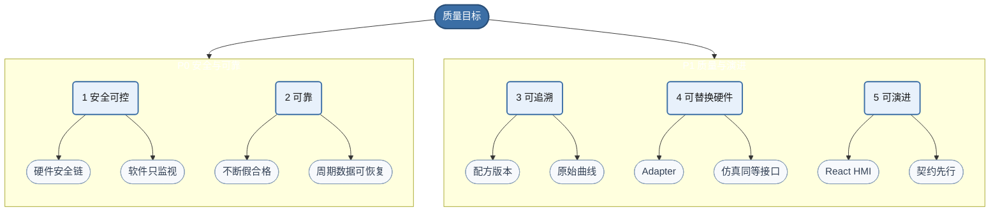

### 1.3 干系人

| 干系人 | 期望 |
|---|---|
| 产线操作员 | 稳定运行界面、条码快速换型、清晰报警与恢复 |
| 工艺/PE | 配方、自定义步骤、包络/PVFS/斜角等参数可配可验证 |
| 质量/QE | 追溯、SPC、曲线回放、导出 |
| 电气/自动化 | 清晰的设备接口、安全边界、I/O 与运动契约 |
| MES/IT | 标准出站载荷、断网补传、幂等 |
| 软件研发 | 可测的判定引擎、仿真闭环、清晰模块边界 |
| 管理层 | 可验收、可复制部署、风险可控的交付节奏 |

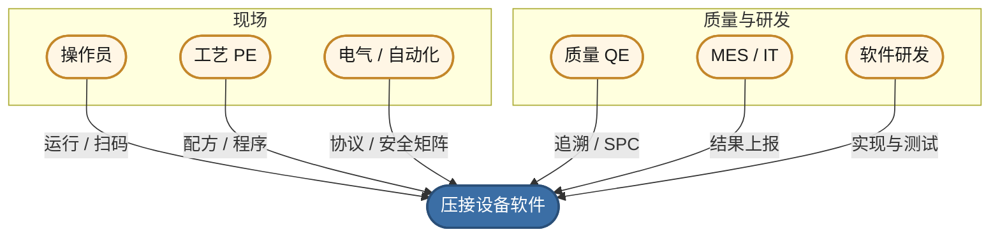

---

## 2. Architecture Constraints（架构约束）

### 2.1 技术约束

- 现场以 **Windows 工控机** 为主；HMI 需支持触屏与开机自启。
- 高频伺服闭环与硬限位应由 **运动控制卡/伺服驱动/PLC** 执行，不依赖 Windows UI 线程。
- 需兼容多种集成方式（需求提及）：文件（TXT/CSV）、数据库（含 Access 遗留）、DLL、Web Service、RS-232/485。
- UI 允许使用 **React**；控制与设备访问不得放在浏览器单页应用内直接完成。

### 2.2 组织与交付约束

- 需求来源目前以截图为主，**采样率、控制周期、算法公式、硬件协议尚未冻结**；架构必须允许“先仿真、后真机”与契约演进。
- 需支持离线编程与快速换模；配方变更必须可审计。

### 2.3 约定

- 物理量单位统一：**力 N、位移 mm、速度 mm/s、角度 Deg**。
- 服务端（Control Service）为机器状态唯一真相源（Source of Truth）。

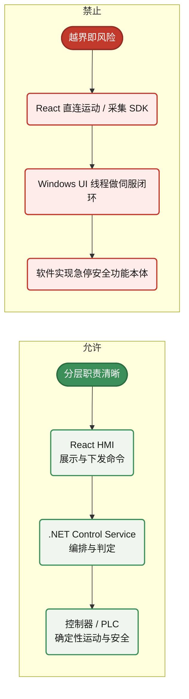

---

## 3. Context and Scope（上下文与范围）

### 3.1 业务上下文

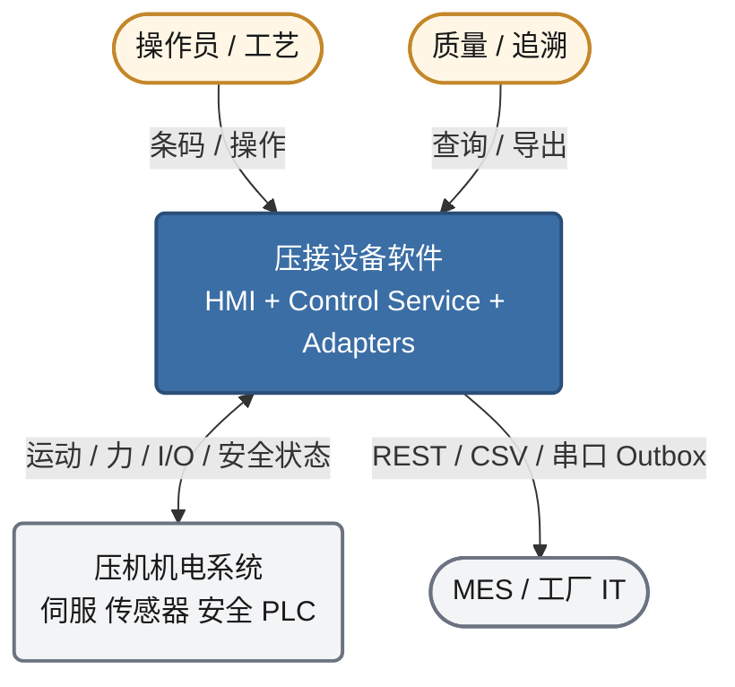

### 3.2 技术上下文（外部接口）

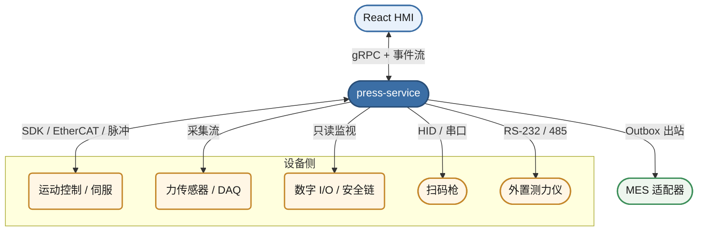

| 邻接系统 | 方向 | 协议/方式 | 说明 |
|---|---|---|---|
| 运动控制 / 伺服 | 双向 | 厂商 SDK / EtherCAT / 脉冲等 | 轨迹、使能、回零、状态 |
| 力传感器 / DAQ | 入 | 采集卡/驱动库 | 力—位移—时间采样 |
| 数字 I/O / 安全 | 入（为主） | I/O 映射 | 急停、光栅、启动使能等只读监视 |
| 扫码枪 | 入 | HID / 串口 | 产品/模具条码 |
| 外置测力仪 | 入 | RS-232/485 | 校准 |
| MES | 出 | REST 优先；CSV/DLL/Access/串口适配 | Outbox 异步 |
| 操作员 | 双向 | React HMI | 运行、编程、查询 |

### 3.3 范围

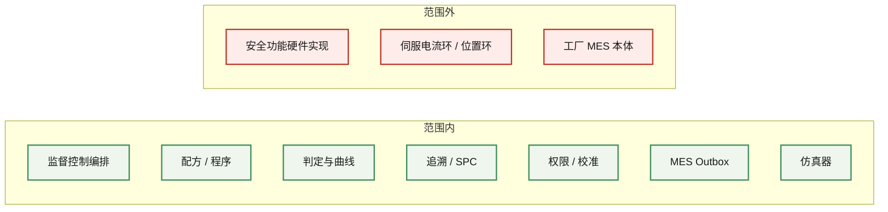

---

## 4. Solution Strategy（方案策略）

### 4.1 总体策略

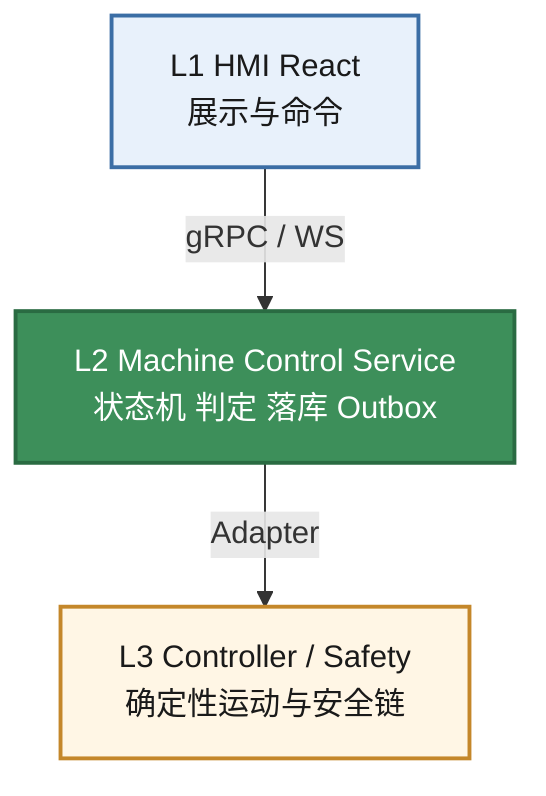

### 4.2 关键技术选型

| 层 | 选型 | 理由 |
|---|---|---|
| HMI | React + TypeScript + Vite | 复杂表单/曲线/追溯开发效率高 |
| 桌面壳 | .NET 8 + WebView2 | 工控机集成、自启、COM/HID、进程守护 |
| 控制服务 | .NET 8 Worker Service | 与 Windows 工业生态、C# SDK 亲和 |
| HMI↔服务 | gRPC + WebSocket/SignalR | 命令查询强类型；状态/曲线实时推送 |
| 本地库 | SQLite WAL | 单机可靠、易备份、零额外运维 |
| 曲线 | 分块二进制 + DB 索引 | 原始数据可复算，UI 另路降采样 |
| 设备 | Adapter 插件 | 仿真与真机同一接口 |
| MES | Outbox + 可插拔 Publisher | 断网不停机、幂等补传 |

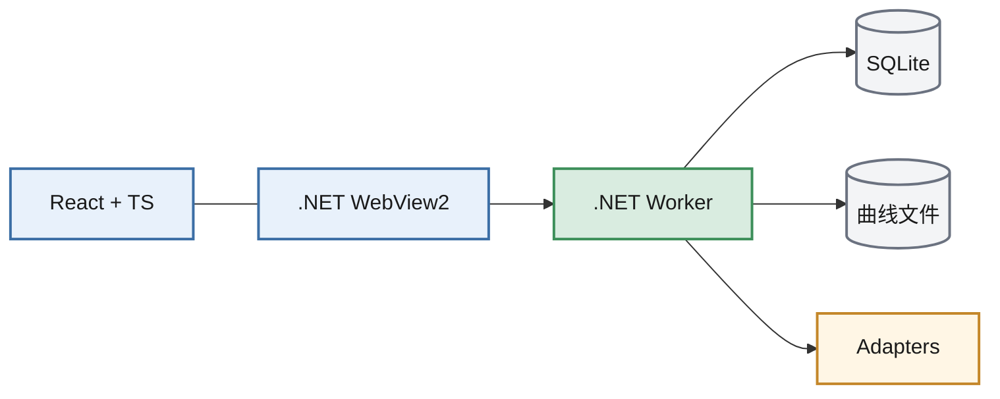

### 4.3 演进策略


---

## 5. Building Block View（构建块视图）

### 5.1 白盒：整体系统（Level 1）

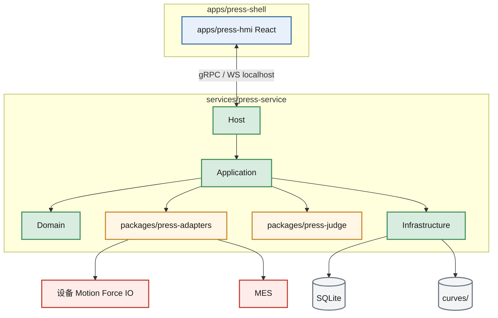

### 5.2 Level 2：press-service 内部

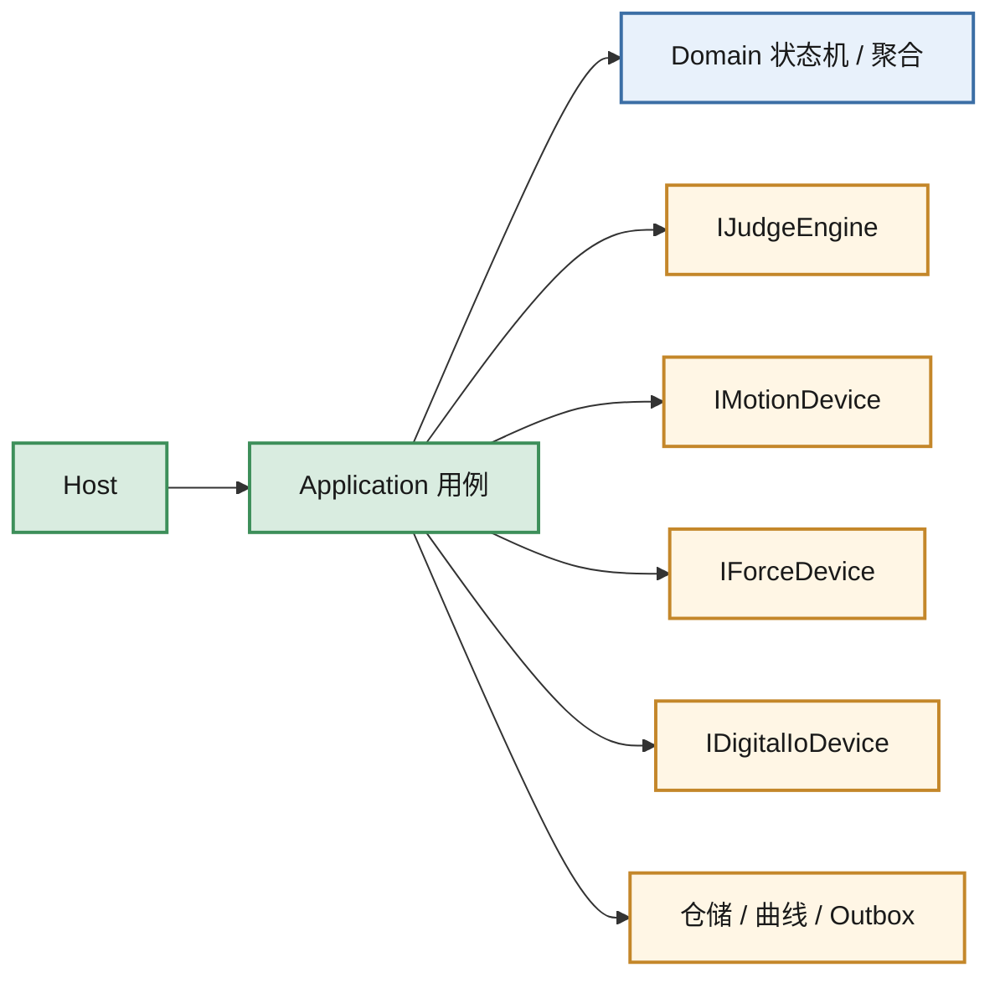

| 构建块 | 职责 | 主要接口 |
|---|---|---|
| Host | DI、gRPC/HTTP 托管、生命周期、看门狗 | 启动配置 |
| Application | 用例：LoadJob、StartCycle、查询追溯、发布配方 | 调用 Domain + Adapters |
| Domain | 状态机、周期聚合根、配方版本规则、报警模型 | 纯领域逻辑 |
| Judge | PVFS/斜角/包络/保压/终判 | `IJudgeEngine` |
| Infrastructure | SQLite、曲线文件、日志、Outbox 存储 | 仓储实现 |
| Adapters | 设备与 MES | `IMotionDevice` 等 |

### 5.3 Level 2：HMI 模块（逻辑）

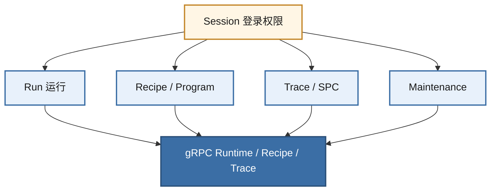

| 模块 | 职责 |
|---|---|
| Run | 实时状态、曲线、启停、产品图叠加 |
| Recipe/Program | 主数据、模板、自定义步骤编辑 |
| Trace/SPC | 查询、导出、控制图 |
| Maintenance | 校准、用户、系统设置、日志 |
| Session | 登录与权限门控 |

### 5.4 契约映射

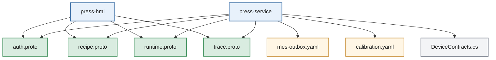

| 构建块 | 契约文件 |
|---|---|
| Auth | `contracts/proto/press/v1/auth.proto` |
| Recipe/Program | `recipe.proto` |
| Runtime | `runtime.proto` |
| Trace/SPC | `trace.proto` |
| MES | `contracts/openapi/mes-outbox.v1.yaml` |
| Calibration | `calibration.v1.yaml` |
| Devices | `packages/press-adapters/.../DeviceContracts.cs` |

---

## 6. Runtime View（运行视图）

### 6.1 场景：自动压接一周期

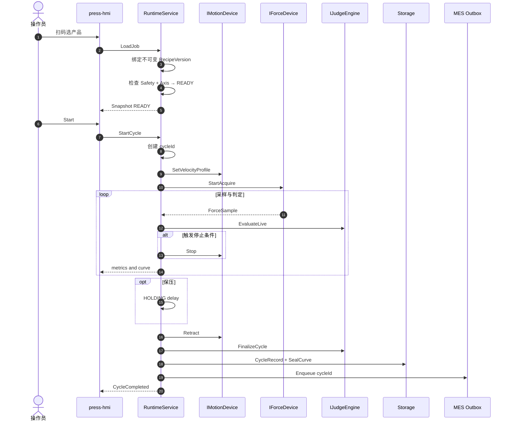

### 6.2 场景：HMI 重连

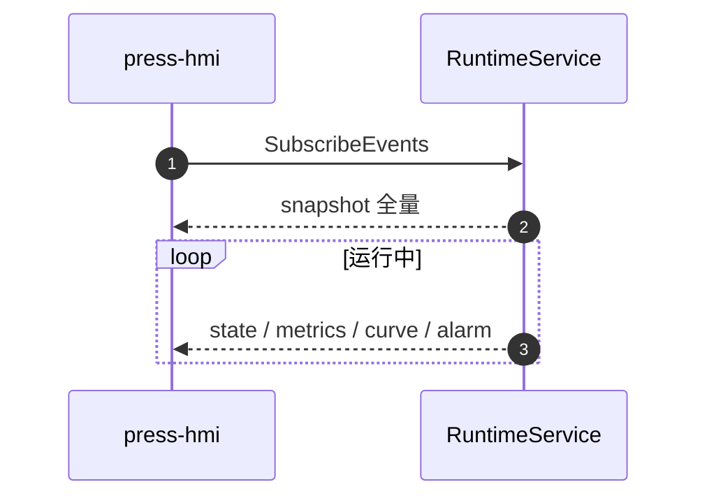

### 6.3 场景：断网 MES

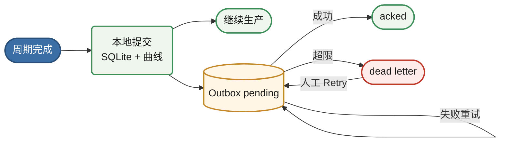

### 6.4 场景：急停

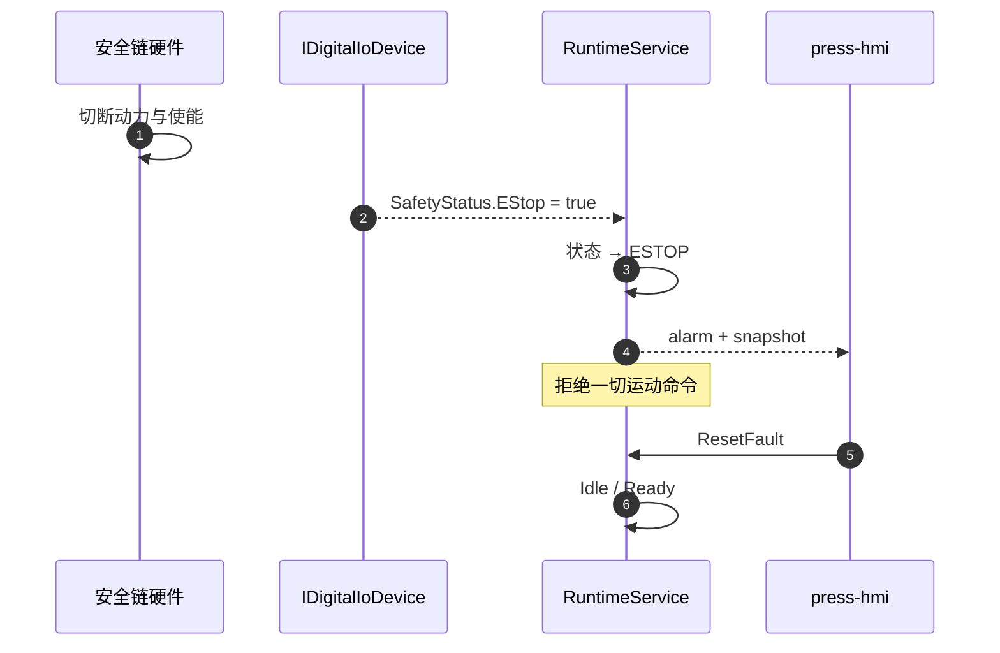

### 6.5 状态机

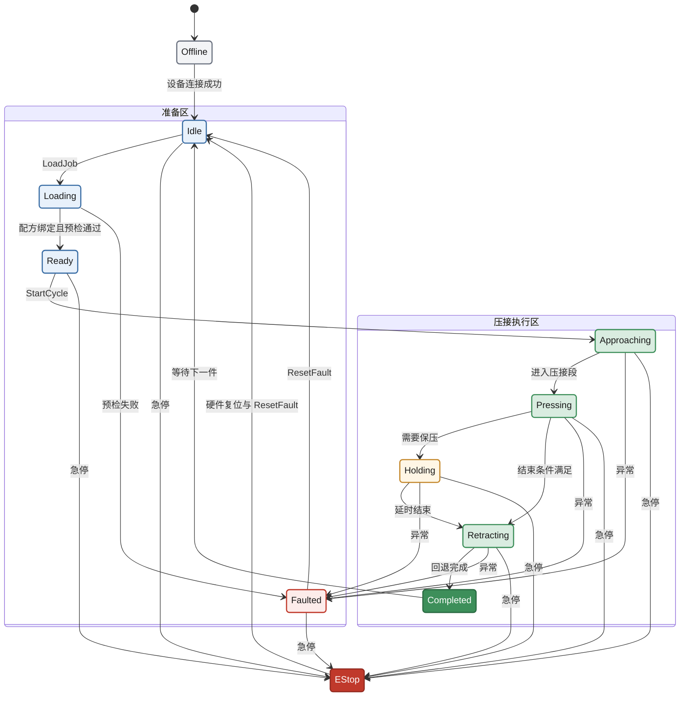

---

## 7. Deployment View（部署视图）

### 7.1 单机工控部署（默认）

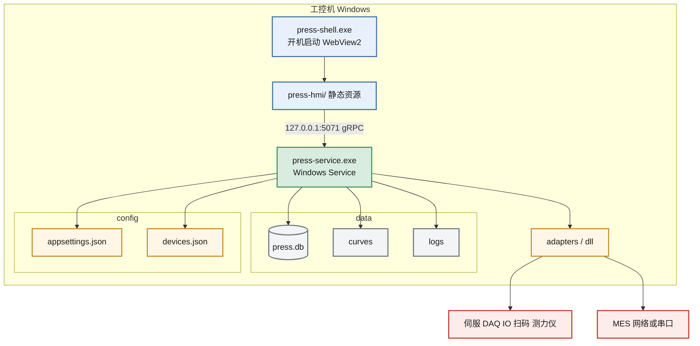

### 7.2 基础设施与端口（建议）

| 组件 | 绑定 | 说明 |
|---|---|---|
| gRPC | `127.0.0.1:5071` | 仅本机 |
| HTTP (MES/校准管理) | `127.0.0.1:5080` | 仅本机；对外由适配器发起 |
| 设备 | COM / PCIe / 网口 | 依硬件 |

```mermaid
flowchart LR
  classDef ui fill:#e8f1fb,stroke:#3b6ea5,color:#1a1a1a,stroke-width:2px
  classDef svc fill:#d9ece0,stroke:#3d8f5a,color:#1a1a1a,stroke-width:2px
  classDef ext fill:#f3f4f6,stroke:#6b7280,color:#1a1a1a,stroke-width:2px

  HMI[HMI]:::ui -->|"5071 / gRPC"| Svc[Service]:::svc
  Maint["维护 / 校准 UI"]:::ui -->|"5080 / HTTP"| Svc
  Svc -->|出站| MES[MES]:::ext
  Svc -->|设备总线| HW[硬件]:::ext
```

### 7.3 更新与回滚

```mermaid
flowchart LR
  classDef pkg fill:#e8f1fb,stroke:#3b6ea5,color:#1a1a1a,stroke-width:2px
  classDef ok fill:#eef6ee,stroke:#3d8f5a,color:#1a1a1a,stroke-width:2px
  classDef bad fill:#fdecea,stroke:#c0392b,color:#1a1a1a,stroke-width:2px
  classDef data fill:#f3f4f6,stroke:#6b7280,color:#1a1a1a,stroke-width:2px

  Pkg["MSI / 安装包"]:::pkg --> Install["安装服务 + HMI + 迁移"]:::pkg
  Install -->|成功| Run[运行新版本]:::ok
  Install -->|失败| Rollback[回滚上一包]:::bad
  Data[("配方 / 曲线数据目录")]:::data -.->|独立保留| Run
  Data -.->|独立保留| Rollback
```

---

## 8. Cross-cutting Concepts（横切概念）

### 8.1 安全概念

```mermaid
flowchart TB
  classDef hw fill:#fdecea,stroke:#c0392b,color:#1a1a1a,stroke-width:2px
  classDef hwTitle fill:#c0392b,stroke:#922b21,color:#ffffff,stroke-width:2px
  classDef sw fill:#e8f1fb,stroke:#3b6ea5,color:#1a1a1a,stroke-width:2px
  classDef swTitle fill:#3b6ea5,stroke:#2a4f78,color:#ffffff,stroke-width:2px

  subgraph HWSafe["硬件安全域"]
    direction TB
    HTitle(["硬接线优先"]):::hwTitle
    ES([急停]):::hw
    LC([光栅]):::hw
    Door([门禁]):::hw
    SPLCr["安全 PLC / 硬接线"]:::hw
    Axis["轴 / 驱动"]:::hw
    HTitle --> ES
    HTitle --> LC
    HTitle --> Door
    ES --> SPLCr
    LC --> SPLCr
    Door --> SPLCr
    SPLCr -->|"切断动力 / 使能"| Axis
  end

  subgraph SWSup["软件监督域"]
    direction TB
    STitle(["只监视不替代"]):::swTitle
    IO([读 SafetyStatus]):::sw
    SM([状态机 ESTOP]):::sw
    Gate([拒绝危险命令]):::sw
    STitle --> IO --> SM --> Gate
  end

  SPLCr -.->|状态反馈| IO
```

### 8.2 配方版本与不可变快照

```mermaid
flowchart LR
  classDef draft fill:#fff6e5,stroke:#c4872a,color:#1a1a1a,stroke-width:2px
  classDef pub fill:#e8f1fb,stroke:#3b6ea5,color:#1a1a1a,stroke-width:2px
  classDef run fill:#eef6ee,stroke:#3d8f5a,color:#1a1a1a,stroke-width:2px

  Draft[编辑草稿]:::draft --> Publish[PublishRecipeVersion]:::pub
  Publish --> V[不可变 RecipeVersion]:::pub
  V --> Cycle["压接周期绑定<br>recipe_version_id + algorithm_version"]:::run
```

### 8.3 时间与采样

```mermaid
flowchart LR
  classDef src fill:#fff6e5,stroke:#c4872a,color:#1a1a1a,stroke-width:2px
  classDef raw fill:#eef6ee,stroke:#3d8f5a,color:#1a1a1a,stroke-width:2px
  classDef ui fill:#e8f1fb,stroke:#3b6ea5,color:#1a1a1a,stroke-width:2px

  DAQ[采集]:::src --> Raw[原始流落盘]:::raw
  DAQ --> Disp[降采样显示流]:::ui
  Raw --> Judge["判定 / 复算"]:::raw
  Disp --> HMI[HMI 曲线]:::ui
```

### 8.4 权限与审计

- 权限键示例：`recipe.edit`、`system.settings`、`user.admin`、`tools.use`、`database.use`。  
- 参数修改记录旧值/新值/操作者/时间。

```mermaid
flowchart TB
  classDef user fill:#fff6e5,stroke:#c4872a,color:#1a1a1a,stroke-width:2px
  classDef gate fill:#e8f1fb,stroke:#3b6ea5,color:#1a1a1a,stroke-width:2px
  classDef ok fill:#eef6ee,stroke:#3d8f5a,color:#1a1a1a,stroke-width:2px
  classDef no fill:#fdecea,stroke:#c0392b,color:#1a1a1a,stroke-width:2px

  User[用户]:::user --> Authz{"权限检查"}:::gate
  Authz -->|允许| Cmd["命令 / 改参"]:::ok
  Authz -->|拒绝| Deny[拒绝]:::no
  Cmd --> Audit["审计日志 who when old new"]:::ok
```

### 8.5 国际化

- HMI 中英资源分离；领域枚举与错误码稳定，文案可翻译。

### 8.6 可测试性

```mermaid
flowchart LR
  classDef in fill:#fff6e5,stroke:#c4872a,color:#1a1a1a,stroke-width:2px
  classDef test fill:#e8f1fb,stroke:#3b6ea5,color:#1a1a1a,stroke-width:2px
  classDef ci fill:#eef6ee,stroke:#3d8f5a,color:#1a1a1a,stroke-width:2px

  Golden[金样曲线]:::in --> JudgeUT[press-judge 单测]:::test
  Sim[Simulation Adapter]:::in --> CycleIT[虚拟压接集成测]:::test
  CycleIT --> CI[CI]:::ci
  JudgeUT --> CI
```

### 8.7 日志级别

```mermaid
flowchart TB
  classDef log fill:#e8f1fb,stroke:#3b6ea5,color:#1a1a1a,stroke-width:2px
  classDef store fill:#d9ece0,stroke:#3d8f5a,color:#1a1a1a,stroke-width:2px

  L1[操作日志]:::log --> Store[可查询追溯]:::store
  L2[报警日志]:::log --> Store
  L3[系统日志]:::log --> Store
  L4[生产记录]:::log --> Store
```

---

## 9. Architecture Decisions（架构决策）

```mermaid
flowchart TB
  classDef adr fill:#e8f1fb,stroke:#3b6ea5,color:#1a1a1a,stroke-width:2px
  classDef core fill:#3b6ea5,stroke:#2a4f78,color:#ffffff,stroke-width:2px

  ADR2["ADR-002 PC监督 控制器实时与安全"]:::core
  ADR1["ADR-001 React HMI + NET 服务"]:::adr
  ADR3["ADR-003 gRPC + 事件流"]:::adr
  ADR6[ADR-006 press-judge 独立]:::adr
  ADR4["ADR-004 SQLite + 曲线文件"]:::adr
  ADR5[ADR-005 MES Outbox]:::adr
  ADR7[ADR-007 遗留接口仅适配器]:::adr

  ADR2 --> ADR1
  ADR1 --> ADR3
  ADR2 --> ADR6
  ADR4 --> ADR5
  ADR1 --> ADR7
```

### ADR-001：UI 用 React，控制用 .NET 服务

- **状态**：Accepted  
- **原因**：UI 复杂度高；设备与实时编排更适合本机服务；WebView2 兼顾工控部署。  
- **后果**：需维护本地 IPC；禁止在 React 内直连运动/采集 SDK。

### ADR-002：PC 做监督控制，控制器做确定性运动与安全

- **状态**：Accepted  
- **原因**：Windows 非硬实时；安全合规要求。  
- **后果**：必须定义清晰的 Motion/IO Adapter 与安全 I/O 映射。

### ADR-003：HMI↔服务契约用 gRPC + 事件流

- **状态**：Accepted  
- **原因**：强类型、流式曲线、多语言生成（C#/TS）。  
- **后果**：需 buf/codegen 流水线。

### ADR-004：本地 SQLite + 曲线文件，而非默认 SQL Server

- **状态**：Accepted（可按客户升级）  
- **原因**：单机部署简单、可靠、易备份。  
- **后果**：多机集中库需另议同步方案。

### ADR-005：MES 采用 Outbox 而非同步调用堵生产

- **状态**：Accepted  
- **原因**：产线可用性优先。  
- **后果**：需死信处理与对账手段。

### ADR-006：判定算法独立为 press-judge 库

- **状态**：Accepted  
- **原因**：可单测、可金样对拍、避免与 UI/IO 纠缠。  
- **后果**：算法版本必须写入配方快照。

### ADR-007：遗留 Access/CSV/DLL 仅作适配器，不作为核心模型

- **状态**：Accepted  
- **原因**：核心域模型现代化；兼容走翻译层。  
- **后果**：字段映射表需维护（已对齐需求截图字段）。

---

## 10. Quality Requirements（质量要求）

> 下列指标在硬件协议冻结前为**目标草案**，FAT 前必须改为可测数值。

| ID | 质量属性 | 场景 | 验收思路 |
|---|---|---|---|
| Q-01 | 安全性 | 急停/光栅触发 | 动力切断由硬件完成；软件进入 ESTOP 且拒绝运动命令 |
| Q-02 | 可靠性 | 压接中杀进程 | 重启后无残损“假 PASS”；未完成周期标记中止/失败 |
| Q-03 | 可靠性 | 断网 24h | 生产不中断；恢复后 Outbox 补传成功或可对账 |
| Q-04 | 性能 | 运行界面 | 曲线显示流畅；控制路径不受 UI 卡顿影响（分线程/进程） |
| Q-05 | 性能 | 采集 | 丢样可检测并报警；采样率达规格（待硬件确认） |
| Q-06 | 可追溯 | 任意历史条码 | 可打开曲线、配方版本、判定、操作者、软件版本 |
| Q-07 | 可维护性 | 换运动卡 | 仅换 Adapter，不改 HMI 与判定核心 |
| Q-08 | 可测试性 | CI | 仿真下完整周期 + 判定金样通过 |
| Q-09 | 可用性 | 误操作 | 关键参数变更需权限；危险操作需状态允许 |
| Q-10 | 部署性 | 升级失败 | 可回滚到上一版本并启动服务 |

```mermaid
flowchart TB
  classDef p1 fill:#fdecea,stroke:#c0392b,color:#1a1a1a,stroke-width:2px
  classDef p2 fill:#fff6e5,stroke:#c4872a,color:#1a1a1a,stroke-width:2px
  classDef p3 fill:#e8f1fb,stroke:#3b6ea5,color:#1a1a1a,stroke-width:2px

  subgraph Hard["优先攻坚 高难度"]
    Q01[Q-01 安全与急停]:::p1
    Q05["Q-05 采集丢样 实时"]:::p1
    Q02[Q-02 崩溃恢复]:::p1
  end

  subgraph Visible["业务可见 中等难度"]
    Q06[Q-06 追溯完整性]:::p2
    Q03[Q-03 MES 断网补传]:::p2
    Q04[Q-04 HMI 流畅度]:::p2
  end

  subgraph Later["可跟进"]
    Q07[Q-07 Adapter 可替换]:::p3
    Q08["Q-08 CI 金样"]:::p3
    Q10[Q-10 升级回滚]:::p3
  end
```

---

## 11. Risks and Technical Debts（风险与技术债）

### 11.1 风险

```mermaid
flowchart TB
  classDef risk fill:#fdecea,stroke:#c0392b,color:#1a1a1a,stroke-width:2px
  classDef mit fill:#eef6ee,stroke:#3d8f5a,color:#1a1a1a,stroke-width:2px

  R1[需求仅截图]:::risk -->|返工| M1[阶段 0 规格冻结]:::mit
  R2[SDK不可得]:::risk -->|阻塞真机| M2["仿真并行 + 探针"]:::mit
  R3[实时进 UI]:::risk -->|误判| M3[服务化门禁]:::mit
  R4[曲线过度降采样]:::risk -->|无法复盘| M4[原始流验收]:::mit
  R5[MES 协议多样]:::risk -->|集成爆炸| M5[统一 Outbox]:::mit
  R6[安全边界不清]:::risk -->|合规风险| M6[安全矩阵联签]:::mit
```

| 风险 | 影响 | 缓解 |
|---|---|---|
| 需求仅有截图，算法/时序未定义 | 返工 | 阶段 0 规格冻结；金样曲线对拍 |
| 硬件协议/SDK 不可得 | 阻塞真机 | 仿真并行；尽早探针实验 |
| 把实时控制塞进 UI 进程 | 抖停、误判 | 强制服务化与代码评审门禁 |
| 曲线只存图或过度降采样 | 无法复盘 | 原始流落盘策略写进验收 |
| MES 协议多样 | 集成爆炸 | Publisher 插件 + 统一 Outbox 载荷 |
| 安全边界不清 | 责任与合规风险 | 与电气联合定义安全矩阵 |

### 11.2 已知技术债（当前骨架阶段）

- 代码生成（buf generate）尚未接入 CI。  
- SQLite schema / 迁移尚未建立。  
- 仿真器与服务宿主尚未实现。  
- 算法公式与滤波参数待工艺确认。  
- OpenAPI 与 gRPC 的鉴权（本机 token）待补强。

---

## 12. Glossary（术语表）

| 术语 | 含义 |
|---|---|
| Press-Fit / 压接 | 无焊压入连接器与 PCB 的工艺 |
| HMI | 人机界面 |
| Recipe / 配方 | 某产品压接参数与关联模具/速度等的版本化集合 |
| Program / 自定义程序 | 步骤表：位置/压力条件与触发动作 |
| PVFS | 采样控制：在位移窗口采样力并推算结束压力 |
| Envelope / 包络 | 由金样曲线生成的力—位移上下界监控 |
| Gradient / 斜角 | 曲线斜率达设定角则停止 |
| Hold / 保压 | 到位后保持静止一段时间 |
| Cycle | 一次压接周期 |
| Outbox | 本地先存、异步投递的集成模式 |
| Adapter | 设备或 MES 的可替换适配实现 |
| Cpk / SPC | 过程能力 / 统计过程控制 |
| FAT / SAT | 出厂验收 / 现场验收 |
| Source of Truth | 状态以 Control Service 为准 |

---

## 附录 A — 仓库映射

```mermaid
flowchart TB
  classDef root fill:#3b6ea5,stroke:#2a4f78,color:#ffffff,stroke-width:2px
  classDef dir fill:#e8f1fb,stroke:#3b6ea5,color:#1a1a1a,stroke-width:2px
  classDef leaf fill:#f7f9fc,stroke:#8aa0b8,color:#334155,stroke-width:1px

  Root[yuanlang]:::root
  Root --> apps:::dir
  Root --> services:::dir
  Root --> packages:::dir
  Root --> tools:::dir
  Root --> contracts:::dir

  apps --> hmi[press-hmi]:::leaf
  apps --> shell[press-shell]:::leaf
  services --> svc[press-service]:::leaf
  packages --> judge[press-judge]:::leaf
  packages --> adp[press-adapters]:::leaf
  tools --> sim[press-sim]:::leaf
  contracts --> proto["proto/press/v1"]:::leaf
  contracts --> oas[openapi]:::leaf
```

| arc42 构建块 | 仓库路径 |
|---|---|
| HMI | `apps/press-hmi` |
| Shell | `apps/press-shell` |
| Control Service | `services/press-service` |
| Judge | `packages/press-judge` |
| Adapters | `packages/press-adapters` |
| Simulator | `tools/press-sim` |
| Contracts | `contracts/` |

## 附录 B — 文档维护

- 架构变更通过 ADR（第 9 章追加）记录。  
- 契约变更走 `contracts` 的 breaking 检查（buf）。  
- 本文件随阶段 0 规格冻结后升级为 v1.0，并替换第 10 章草案指标为实测阈值。  
- Mermaid 约定：仅用 `flowchart` / `sequenceDiagram` / `stateDiagram-v2`；多行用 `<br>`；含 `/` `.` `*` 的文案必须用引号；不要使用 `%%{init}`（部分预览器会报语法错）。
